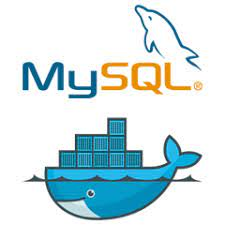

# 
AllForOne

Achei super interessante mesmo foi desenvolver as principais queries do MySQL fazendo um CRUD (create, read, update, delete) no bando de dados Northwind, dentro do Docker.

Inicializei dois containers um chamado all_for_one, e outro chamado all_for_one_db. Abri o container all_for_one(docker exec -it all_for_one bash) no VS Code, e o melhor ainda, usei extensão MySQL no Code para executar as queries. Recomendo muito a extensão para todos!!

Ah foi muito legal relembrar aprendizados de outra época, só que agora no desenvolvimento web!!

Foi muito divertido conseguir a nota máxima!!!
